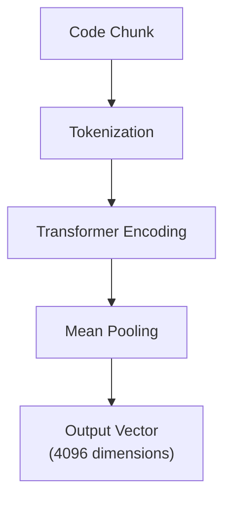

SHARC uses state-of-the-art embeddings to understand the semantic meaning of code. This page explains the embedding model, generation process, and optimization techniques.

## Embedding Model

### Sharc-Embed

SHARC's embedding model is optimized for code:

| Property | Value |
|----------|-------|
| Model | Sharc-Embed |
| Dimensions | 4096 |
| Max Tokens | 8192 |

### Key Features

1. **Code-optimized**: Trained on large code corpora
2. **High dimensionality**: 4096 dims capture nuanced semantics
3. **Long context**: 8K tokens handles large functions

## Embedding Generation

### Process Overview



### Batching Strategy

Embeddings are generated in batches for efficiency:

- **Batch size**: Up to 200 texts per request
- **Parallel processing**: Multiple batches processed concurrently
- **Processing 2000 chunks**: ~3-5 seconds total

## Vector Storage

### Full Dimensions

Unlike some implementations that truncate embeddings, SHARC stores the full 4096 dimensions:

```
MRL Truncation (other tools):
  4096 → 1024 dims (75% information loss)

SHARC:
  4096 → 4096 dims (no loss)
```

### Normalization

Vectors are L2-normalized for cosine similarity:

```typescript
// Before normalization
[0.5, 0.3, 0.8, ...]

// After normalization (unit length)
[0.47, 0.28, 0.75, ...] // ||v|| = 1
```

This enables efficient cosine similarity via dot product.

## Context Injection

Embeddings capture more than raw code. SHARC injects context:

### For Code (AST-parsed)

```typescript
// Original function:
async authenticate(user: string): Promise<boolean> { ... }

// With injected context:
// Context: class AuthService > module auth (services/auth.ts)
async authenticate(user: string): Promise<boolean> { ... }
```

The embedding now "knows":
- This is a method in `AuthService`
- It's in the `auth` module
- File is `services/auth.ts`

### With Decorators

```typescript
// TypeScript/JavaScript with decorators:
// Context: class UserController @Controller("/users") (controllers/user.ts)
// @Get("/:id") @Auth
async getUser(id: string): Promise<User> { ... }
```

### For Documentation

```markdown
// Original:
## Authentication
Users must provide valid credentials...

// With file context:
// File: docs/security/authentication.md
## Authentication
Users must provide valid credentials...
```

## Semantic Properties

### What Embeddings Capture

| Property | Example |
|----------|---------|
| **Function purpose** | "authentication" vs "validation" |
| **Code patterns** | async/await, error handling |
| **Data structures** | arrays, objects, classes |
| **Domain concepts** | "user", "payment", "order" |
| **Relationships** | caller-callee, inheritance |

### Similarity Examples

```
Query: "user authentication"

High similarity (0.9+):
- async function authenticateUser(credentials) { ... }
- class AuthenticationService { verify() { ... } }

Medium similarity (0.7-0.9):
- function validateUserInput(input) { ... }
- const userSession = { authenticated: true }

Low similarity (< 0.5):
- const styles = { color: 'red' }
- function calculateTax(amount) { ... }
```

## Performance Metrics

| Metric | Value |
|--------|-------|
| Latency (200 texts) | ~500ms |
| Throughput | ~2000 texts/second |
| Batch efficiency | 10x vs single requests |
| Memory per embedding | 16KB (4096 x 4 bytes) |

## Troubleshooting

### Slow Embedding Generation

1. Re-index the codebase if search results look stale.
2. Ensure your codebase indexing completed successfully.
3. Retry with a more specific semantic query.

