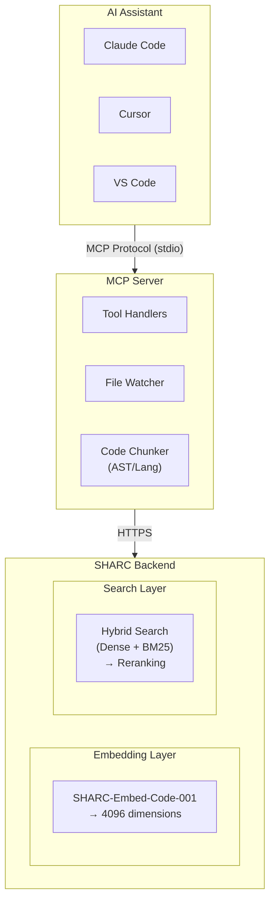
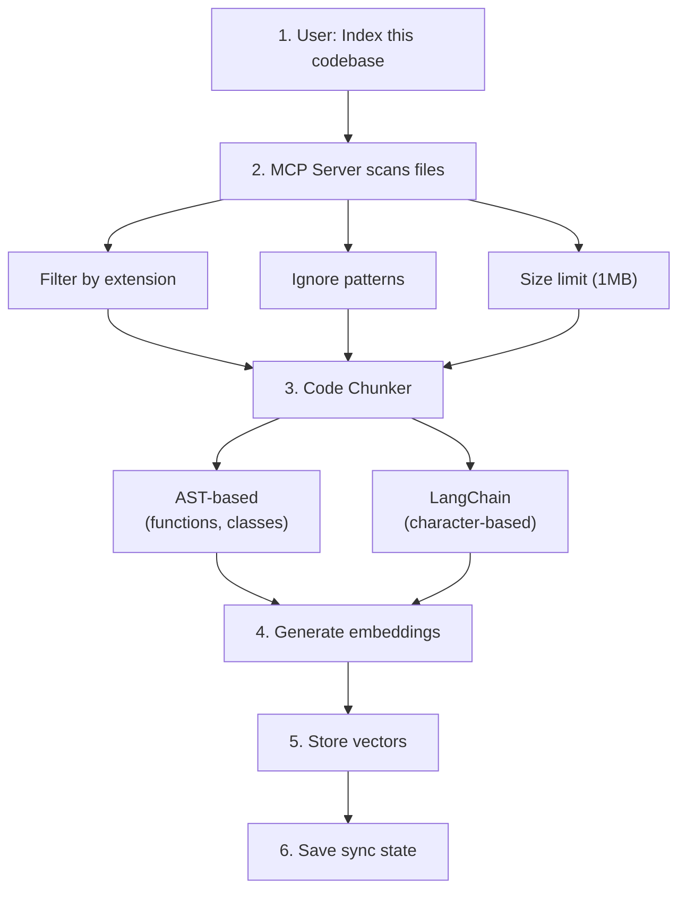
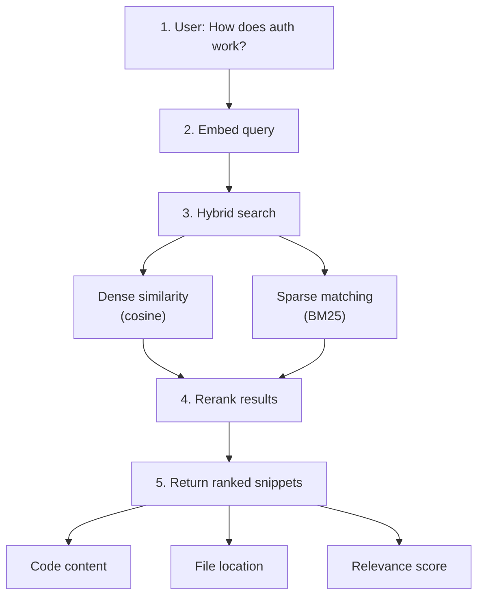

SHARC (Semantic Hybrid Architecture for Repository Code-search) combines state-of-the-art embeddings, hybrid vector search, and intelligent code chunking to provide semantic code search for AI assistants.

## System Architecture

## Core Components

### 1. MCP Server

The Model Context Protocol server that connects to AI assistants:

- **Tool Handlers**: Implements 7 MCP tools for indexing/search
- **File Watcher**: Real-time incremental indexing
- **Code Chunker**: AST-based splitting for semantic units

### 2. Backend API

High-performance server handling:

- **Embeddings**: Generate 4096-dimensional vectors
- **Search**: Hybrid search + reranking
- **Storage**: Vector collections + sync metadata

### 3. Models

| Model | Purpose | Dimensions |
|-------|---------|------------|
| SHARC-Embed-Code-001 | Code embeddings | 4096 |
| SHARC-Rank-Pro-001 | Relevance scoring | - |

## Data Flow

### Indexing Flow

### Search Flow

## Key Design Decisions

### Why Hybrid Search?

Dense vectors excel at semantic similarity, but miss exact keyword matches. BM25 catches these:

| Query | Dense Only | Hybrid |
|-------|------------|--------|
| "authenticate user" | Finds auth code | Same |
| "JWT validation" | Might miss | Finds exact match |
| "function getUserById" | Misses | BM25 finds it |

### Why AST-Based Chunking?

Traditional text chunking breaks code at arbitrary points. AST chunking:

- Extracts complete functions/classes
- Preserves semantic context
- Injects parent class/module information
- Includes decorator/annotation context

### Why 4096 Dimensions?

Full embedding dimension provides:
- Maximum semantic resolution
- Better differentiation of similar code
- No information loss from truncation

### Why Incremental Sync?

Merkle-based sync enables:
- O(log n) change detection
- ~0.3s for unchanged codebases
- Only re-index modified files

## Performance Characteristics

| Operation | Time | Notes |
|-----------|------|-------|
| Full index (2000 chunks) | 15-20s | One-time |
| Incremental (no changes) | ~0.3s | Hash comparison |
| Incremental (10 files) | 2-4s | Only changed |
| Search query | 100-200ms | Including rerank |
| File watcher update | 2-3s | Debounced |

## Next Steps

<CardGroup cols={2}>
  <Card title="Embeddings" href="/architecture/embeddings" icon="cpu">
    Deep dive into the embedding model and generation.
  </Card>
  <Card title="Code Chunking" href="/architecture/code-chunking" icon="zap">
    How code is split into semantic units.
  </Card>
</CardGroup>

