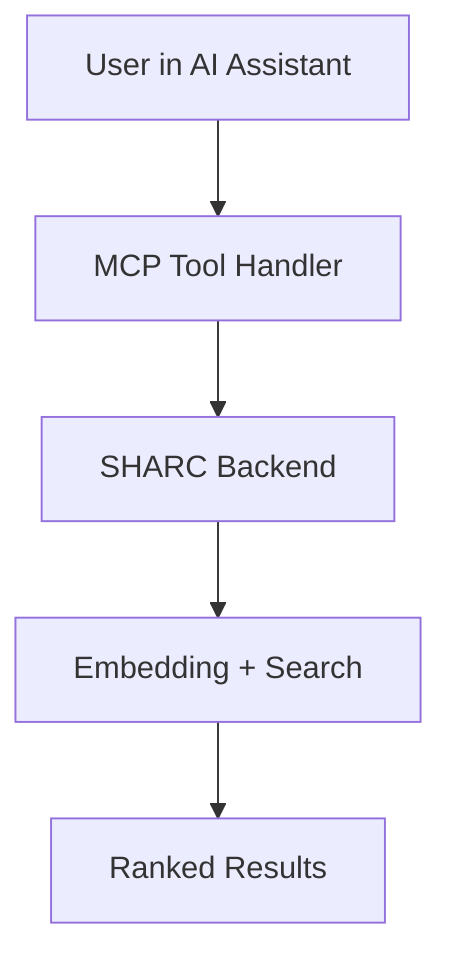

**SHARC** (Semantic Hybrid Architecture for Repository Code-search) is a powerful MCP-powered semantic code search tool that helps AI assistants understand and navigate codebases more efficiently.

## What is SHARC?

SHARC provides semantic code search capabilities to AI assistants like Claude Code, Cursor, and other MCP-compatible tools. Instead of relying on keyword matching or file-by-file exploration, SHARC uses state-of-the-art embeddings to understand the meaning of your code and find relevant results instantly.

## Key Benefits

<CardGroup cols={2}>
  <Card title="10x Fewer Tool Calls" icon="zap">
    Semantic search finds relevant code directly, eliminating the need for multiple grep/read operations.
  </Card>
  <Card title="33x Less Code to Process" icon="file-minus">
    Return only the most relevant code snippets instead of entire files.
  </Card>
  <Card title="15x Faster Results" icon="clock">
    Get answers in seconds, not minutes. Real-time file watching keeps your index current.
  </Card>
</CardGroup>

## Quick Links

<CardGroup cols={2}>
  <Card title="Getting Started" href="/getting-started" icon="rocket">
    Install SHARC and configure it with your AI assistant in minutes.
  </Card>
  <Card title="MCP Tools" href="/mcp/tools" icon="wrench">
    Learn about the 7 MCP tools available for indexing and searching.
  </Card>
  <Card title="Packages" href="/packages" icon="box">
    See published NPM packages for the MCP server and code splitter.
  </Card>
  <Card title="Architecture" href="/architecture" icon="cpu">
    Understand how SHARC works under the hood.
  </Card>
</CardGroup>

## How It Works



## Get Started

The fastest way to get started is with Claude Code:

```bash
claude mcp add sharc \
  -e SHARC_API_KEY=sk_mcp_e364ff9... \
  -- npx @sharc-code/mcp@latest
```

Then index your codebase and start searching:

```
> Index this codebase for semantic search

● index_codebase (MCP)
  ⎿ Indexed 2,450 chunks from 342 files in 18.3s

> How does authentication work in this project?

● search_code (MCP)
  ⎿ Found 3 results for query: "authentication"
```


