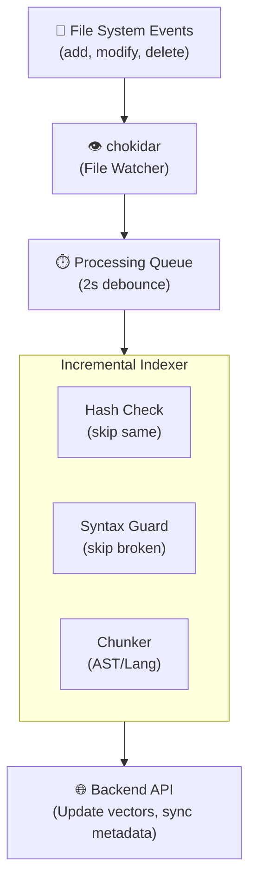

SHARC's file watching system keeps your index up-to-date as you modify code. This enables real-time semantic search without manual re-indexing.

## How It Works



## Automatic Activation

File watching starts automatically after `index_codebase` completes:

```
> Index this codebase

● index_codebase (MCP)
  ⎿ Indexed 3,450 chunks in 22.4s
  ⎿ File watcher started ← Automatic!
```

You don't need to call `start_watch` separately.

## Event Processing

### Debouncing

SHARC waits 2 seconds after the last file change before processing. This:

- Batches rapid changes (e.g., IDE auto-save)
- Reduces redundant API calls
- Prevents indexing incomplete saves

### Deduplication

If the same file changes multiple times within the debounce window, only the final state is indexed.

### Hash Checking

Before re-indexing a file, SHARC compares SHA-256 hashes:

- **Same hash**: Skip (no actual change)
- **Different hash**: Re-index the file

This prevents unnecessary work when files are touched but not modified.

## Syntax Guard

SHARC validates syntax before indexing to prevent corrupted vectors:

### Supported Languages

Full AST validation for:
- TypeScript / JavaScript
- Python
- Go
- Rust
- Java
- C / C++
- C#
- Scala

### How It Works

1. Parse file with tree-sitter
2. Check for syntax errors
3. If errors found:
   - **Keep old vectors** (don't corrupt the index)
   - **Skip indexing** until syntax is fixed
4. If valid:
   - Remove old vectors
   - Index new content

### Example Scenario

```
1. User saves auth.ts with incomplete code:
   export async function authenticate(
   // Missing closing brace

2. Syntax guard detects error

3. Old vectors preserved:
   "The authenticate function validates JWT tokens..."

4. User completes the code:
   export async function authenticate(token: string) {
     return jwt.verify(token);
   }

5. File re-indexed with new content
```

## File Filters

### Automatically Ignored

SHARC skips files that shouldn't be indexed:

```
node_modules/**, target/**, dist/**, build/**, out/**, .next/**, .nuxt/**, .svelte-kit/**,
.turbo/**, .parcel-cache/**, .cache/**, coverage/**, .nyc_output/**, __pycache__/**,
.pytest_cache/**, .mypy_cache/**, .ruff_cache/**, .tox/**, .nox/**, .venv/**, venv/**, env/**,
.git/**, .svn/**, .hg/**, .idea/**, .vscode/**, tmp/**, temp/**, logs/**, *.log, *.min.js,
*.min.css, *.bundle.js, *.chunk.js, *.map
```

### Size Limits

- **Maximum file size**: 1MB
- Files larger than this are skipped (usually generated/minified code)

### Custom Extensions

Add custom file types during indexing:

```
index_codebase({
  path: "/my/project",
  customExtensions: [".vue", ".svelte", ".astro"]
})
```

### Custom Ignore Patterns

Exclude specific files or directories:

```
index_codebase({
  path: "/my/project",
  ignorePatterns: [
    "vendor/**",
    "generated/**",
    "*.generated.ts"
  ]
})
```

Patterns use glob semantics. Examples:
- `static/**` excludes a directory tree
- `*.tmp` excludes matching files at any depth
- `private/**` excludes private source trees

Team-dependent patterns like `vendor/**`, `third_party/**`, and `generated/**` are not enabled by default; add them via `ignorePatterns` when needed.

## Performance

| Event | Processing Time | Notes |
|-------|-----------------|-------|
| Single file modify | ~2-3s | Debounce + embed + store |
| Multiple files (batch) | ~3-5s | Parallel embedding |
| Large file (>100 chunks) | ~5-8s | More chunks to process |
| No actual change | ~0.1s | Hash check, skip |
| Syntax error | ~0.1s | Skip, keep old vectors |

## Manual Control

### Stop Watching

To disable automatic updates:

```
> Stop watching this project

● stop_watch (MCP)
  path: "/my/project"
  ⎿ ✓ Stopped watching
```

### Resume Watching

To re-enable:

```
> Start watching again

● start_watch (MCP)
  path: "/my/project"
  ⎿ ✓ Started watching
```

### Check Status

```
> What's being watched?

● get_watch_status (MCP)
  ⎿ Watching 2 codebases:
  ⎿ 1. /projects/app-a
  ⎿ 2. /projects/app-b
```

## Troubleshooting

### Changes Not Detected

1. Verify watching is active: `get_watch_status`
2. Check file extension is supported
3. Ensure file is not in ignored patterns
4. File might be too large (>1MB)

### Slow Updates

1. Check network connectivity to backend
2. Large files take longer to process
3. Many simultaneous changes batch together

### Index Out of Sync

If the index seems outdated:

```
> Force re-index this codebase

● index_codebase (MCP)
  path: "/my/project"
  force: true
  ⎿ Deleting existing index...
  ⎿ Full re-index starting...
```

