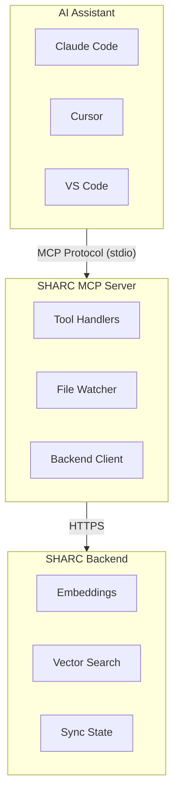

SHARC operates as an **MCP (Model Context Protocol) server** that provides semantic code search capabilities to AI assistants. This section covers how the MCP integration works and the tools available.

## What is MCP?

The Model Context Protocol (MCP) is a standard for connecting AI assistants to external tools and data sources. SHARC implements MCP to provide:

- **Semantic code indexing** - Understand your codebase structure
- **Natural language search** - Find code using plain English
- **Real-time updates** - File watching keeps your index current

## Architecture



## Available Tools

SHARC provides **7 MCP tools** organized into three categories:

### Indexing & Search

| Tool | Description |
|------|-------------|
| `index_codebase` | Index a codebase for semantic search |
| `search_code` | Search indexed code using natural language |
| `clear_index` | Remove a codebase from the index |
| `get_indexing_status` | Check indexing progress |

### File Watching

| Tool | Description |
|------|-------------|
| `start_watch` | Start watching for file changes |
| `stop_watch` | Stop watching a codebase |
| `get_watch_status` | List actively watched codebases |

## Key Features

### Backend-Only Architecture

SHARC delegates all heavy operations to the backend:

- **Embeddings** - Generated via SHARC-Embed-Code-001
- **Vector Storage** - Hybrid search (dense + BM25 sparse)
- **Sync State** - Merkle snapshots for incremental updates

This keeps the MCP server lightweight and fast.

### Merkle Diff Incremental Sync

When re-indexing a codebase, SHARC uses Merkle tree comparison:

1. Load previous file hashes from backend
2. Compute current file hashes
3. Identify added/modified/deleted files
4. Only re-index changed files

**Result**: ~0.3s for unchanged codebases vs 15-30s for full re-index.

### Real-Time File Watching

After initial indexing, SHARC automatically watches for changes:

- Uses chokidar for cross-platform file system events
- 2-second debounce to batch rapid changes
- Syntax validation prevents indexing broken code
- Changes sync to backend incrementally

## Quick Reference

```typescript
// Index a codebase
index_codebase({
  path: "/absolute/path/to/project",
  force: false,  // Set true to rebuild from scratch
  customExtensions: [".vue", ".svelte"],  // Additional file types
  ignorePatterns: ["vendor/**"]  // Files to skip
})

// Search for code
search_code({
  path: "/absolute/path/to/project",
  query: "authentication middleware",
  limit: 3,  // Default: 3, Max: 50
  extensionFilter: [".ts", ".tsx"]  // Optional file type filter
})

// Check status
get_indexing_status({ path: "/absolute/path/to/project" })
```

## Next Steps

<CardGroup cols={2}>
  <Card title="MCP Tools Reference" href="/mcp/tools" icon="wrench">
    Detailed documentation for all 7 tools with examples.
  </Card>
  <Card title="File Watching" href="/mcp/file-watching" icon="eye">
    Learn about real-time incremental indexing.
  </Card>
  <Card title="Configuration" href="/mcp/configuration" icon="settings">
    Environment variables and advanced settings.
  </Card>
</CardGroup>


